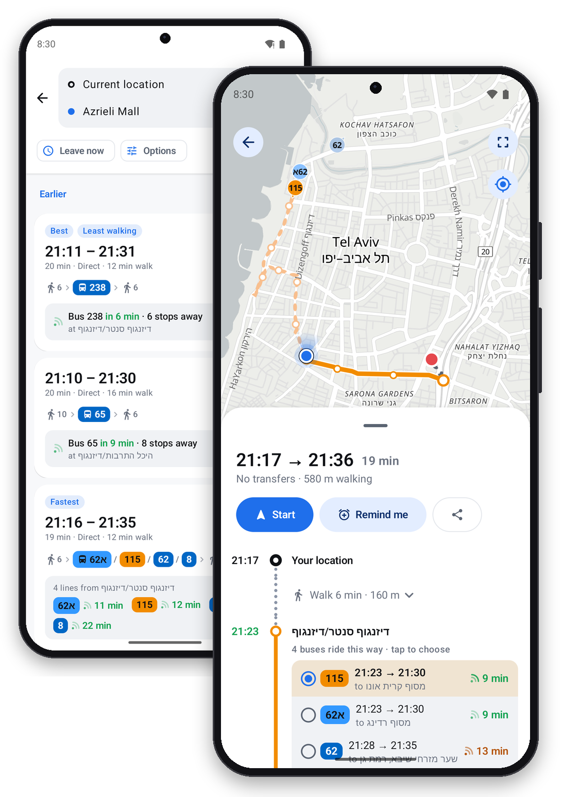

#  Maslul



A free, open-source public transport app for Israel (Android). No ads, no accounts, no tracking. It's serverless: the app talks directly to public open-data services, so there's nothing to host or pay for.

## Download

Get the latest APK from the [Releases](../../releases) page. A Play Store release will probably come in the future.

## Features

- Route planning, combining buses that ride the same stretch, with a pick of which bus to take
- Live arrivals, color-coded by how fresh the data is (live / stale / timetable only)
- Live bus locations on the map, updated automatically
- Catches earlier buses that are running late, not just the next scheduled one
- Line and stop screens, favorites, trip reminders
- Operator colors (Egged, Dan, Metropoline, …) and bus platform numbers at big stations
- Rotatable map with a compass and a direction beam on your location
- Simple Maslul: an optional mode with six big buttons (five places you set, plus any address) and plain step-by-step directions in English, Hebrew or Russian, made for grandparents and anyone who wants it easy. Turn it on in Settings
- Optional [advanced tools](docs/advanced-features.md): find where to be dropped off when someone gives you a ride (טרמפ), add your own shuttles (like a company bus), and plan from the bus you're already on

## Data sources

- **Routes & timetables:** [Transitous](https://transitous.org) (MOTIS), built on the Ministry of Transport GTFS feed
- **Live vehicles:** the Ministry of Transport SIRI feed, via [Hasadna's Open Bus](https://github.com/hasadna/open-bus-siri-requester) public snapshots
- **Line data:** [Open Bus Stride API](https://open-bus-stride-api.hasadna.org.il)
- **Maps:** [OpenFreeMap](https://openfreemap.org) / OpenStreetMap
- **Address search:** Photon and Nominatim (OpenStreetMap)

## Building

Requires Android Studio (or the Android SDK) and JDK 17+.

```bash
./gradlew assembleDebug        # build
./gradlew testDebugUnitTest    # run unit tests
./gradlew installDebug         # install on a connected device
```

## Contributing

Ideas, bug reports and changes are welcome. [Open an issue](../../issues) for a feature request or bug, or send a pull request.

## License

[GNU Affero General Public License v3.0](LICENSE). You're free to use, change and share Maslul, as long as your version stays open source under the same license.
