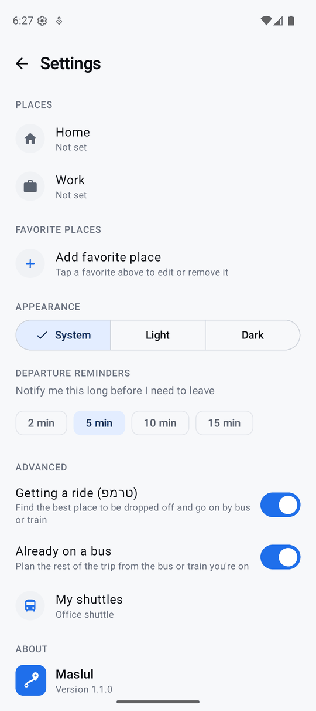
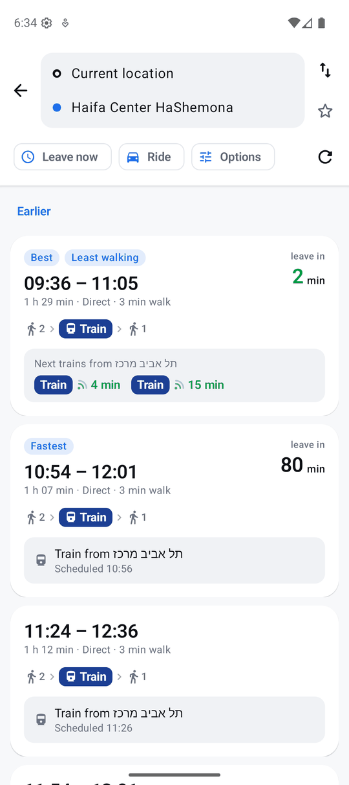
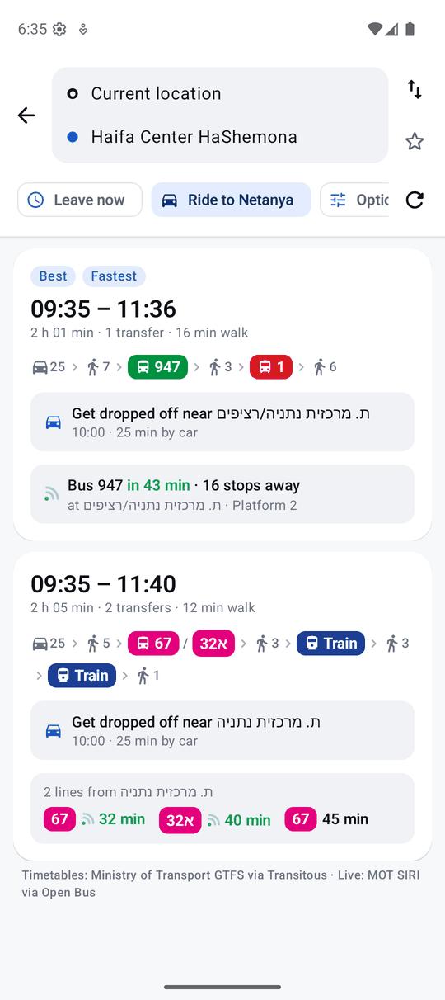
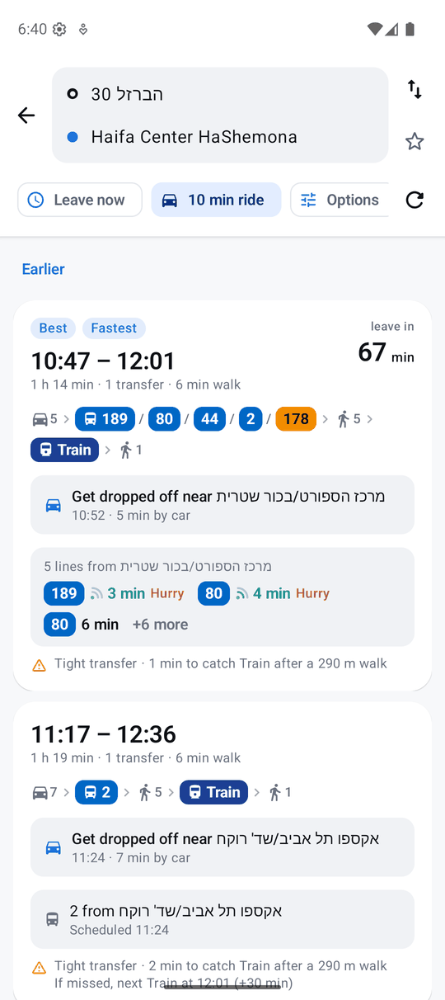
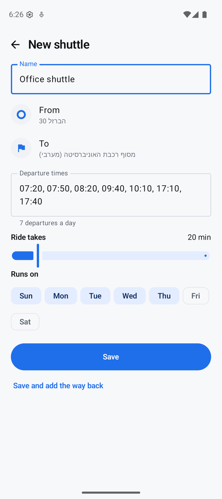
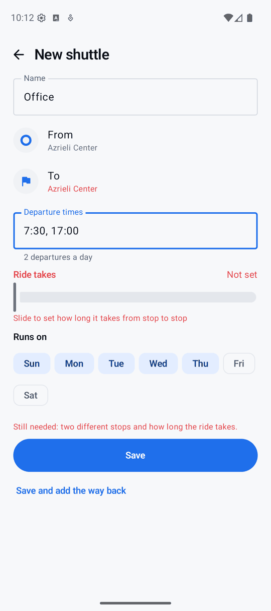
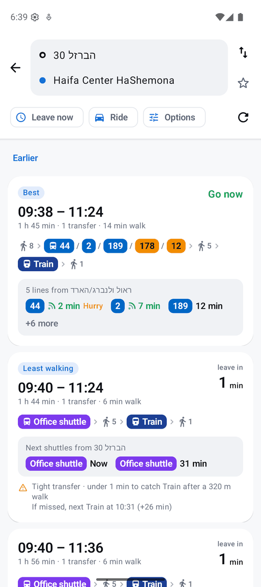
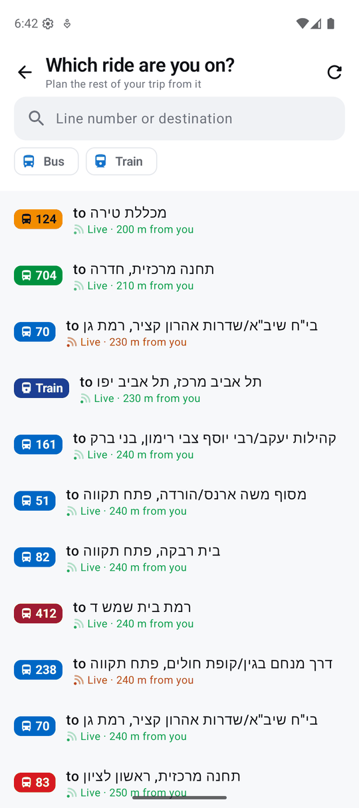
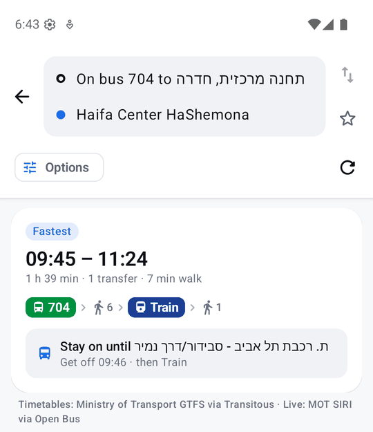
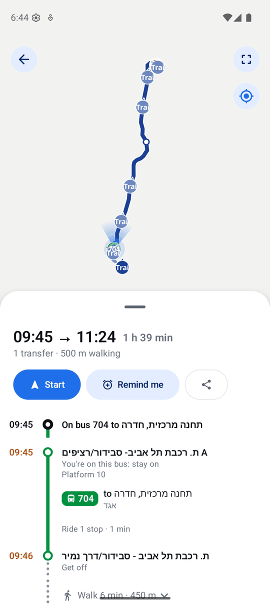

# Advanced features

These tools are for trips the usual planner can't help with. **Getting a ride** and **Already on a bus** are on from the start; turn either off in **Settings → Advanced** if you don't need it.

## Getting a ride (טרמפ)

Someone is driving you part of the way, and you'll go on by bus or train. The question is where to get out.

On the route results, tap the **Ride** chip and choose one of these:

- **The driver is going somewhere.** Pick where they're heading. Maslul follows their route and tries places along the way to be dropped off. For each place it plans the rest of your trip from the time you'd get there, then shows the best ones. Each option says where to get out, for example "Get dropped off near Netanya central station · 10:00 · 25 min by car".
- **The driver can take me up to…** If someone offers "I'll take you wherever, but only about 10 minutes away", pick how long they'll drive. Maslul finds the best place to be dropped off within that drive. If your destination is close enough, one option is just driving all the way.

  

The chip shows the ride you set, for example "Ride to Netanya" or "10 min ride". To go back to normal planning, open it and tap **No ride, plan as usual**.

## My shuttles

Some shuttles aren't in the public timetables, such as a company bus from the office to the train station. Add them in **Settings → Advanced → My shuttles**:

- a name, where it leaves from and where it goes
- its departure times, typed like `07:30, 08:15, 17:00`
- how long the ride takes and the days it runs

The ride time has no default, so slide to set it. If anything is missing when you tap **Save**, Maslul says what and marks it in red.

**Save and add the way back** starts the return trip with the stops swapped. You only need to enter its times.

From then on, trip planning offers the shuttle wherever it helps, on its own or combined with buses and trains: for example office → shuttle → train home. Getting to the shuttle is planned to arrive just before it leaves. Its next departures are listed like any other ride's, and so is the next shuttle if you miss one.

  

## Already on a bus

You're already on a bus or train, and wondering where to get off, or whether to change.

A small **On a bus?** button appears on the map; the From field also offers **On a bus or train now**.

1. **Pick your ride.** You'll see the buses and trains around you, live ones nearest first. You can type a line number or destination to filter, or pick a mode.
2. **Choose where you're going.**
3. **Read the answer.** The options start on the bus you're on, for example "Stay on until Savidor station · get off 09:46 · then Train". Sometimes getting off at the next stop to change is better, and you'll see that too.

  

Live directions (**Start**) work as usual from here: Maslul tells you when your stop is next.

## Good to know

- Rides and on-board plans try several places to get out, so they take a few seconds longer than a normal search. The first options show as soon as they're found, and a thin bar at the top shows more are on the way.
- Shuttles are kept on your phone only, like the rest of your places and settings.
